# AI That Amplifies Human Purpose

## TLDR

We help purpose-driven organizations implement AI that enhances human capabilities while preserving what makes work meaningful. As AI handles routine tasks, the future belongs to organizations that combine technological capability with authentic human purpose, self-management, and regenerative impact.

**What makes us different:** We focus on the intersection of AI implementation, individual purpose alignment, and organizational transformation toward self-managing, human-centered structures.

---

## The 4-Minute Read

### The Moment We're In

AI is fundamentally changing how work gets done. As artificial intelligence handles more routine cognitive tasks, **economic value is shifting from task execution to uniquely human capabilities**: deep thinking, creative problem-solving, ethical judgment, and authentic relationship building.

This creates both unprecedented opportunity and risk. For purpose-driven organizations, this moment can be particularly complex, often surfacing challenges like a fear of dehumanization, a lack of technical fluency in leadership, or concerns about misalignment with core values.

This creates both unprecedented opportunity and risk. Organizations can either:
- **Race to the bottom**: Use AI to do the same work faster, creating temporary gains that competitors quickly match
- **Transform fundamentally**: Reimagine how they create value by amplifying human creativity, purpose, and collaboration

```mermaid
graph LR
    Start[["AI Adoption<br/>Decision Point"]] --> Choice{Strategic Choice}
    
    Choice -->|Efficiency Focus| Bottom["Race to Bottom<br/>🔄 Same work, faster<br/>⚡ Temporary gains<br/>📉 Commoditization"]
    Choice -->|Transformation Focus| Transform["Fundamental Transform<br/>🚀 Reimagined value creation<br/>🎨 Human creativity amplified<br/>📈 Sustainable advantage"]
    
    Bottom --> Outcome1["Competitors catch up<br/>Margin compression"]
    Transform --> Outcome2["Unique capabilities<br/>Market leadership"]
    
    style Start fill:#f9f9f9
    style Bottom fill:#ffebee
    style Transform fill:#e8f5e8
    style Outcome1 fill:#ffcdd2
    style Outcome2 fill:#c8e6c8
```

### Our Vision: Technology Serving Human Flourishing

We believe the future belongs to organizations that embrace **distributed decision-making** and **authentic contribution**—where people bring their full potential to work in service of shared purpose.

> **Key Insight**: As AI commoditizes execution, the organizations that thrive will be those that excel at the things AI cannot replicate: curiosity, curation of meaning, complex judgment, and genuine human connection.

### The Transformation We Support

We work with organizations evolving toward:

**🌱 Self-Management**: Distributed authority where decisions are made by those with the most relevant expertise and stake in the outcome

**🤝 Wholeness**: Environments where people can bring their full selves to work, integrating personal purpose with organizational mission  

**🎯 Evolutionary Purpose**: Clear mission that transcends profit, guiding all decisions toward regenerative impact

**🤖 AI Partnership**: Technology that augments human capabilities rather than replacing human judgment

### What We Do

**For Organizations:**
- AI strategy and implementation that aligns with your values
- Process automation that preserves human agency
- Organizational development toward self-managing structures
- Integration of AI tools within existing workflows

**For Individuals:**
- Personal purpose discovery and alignment with work
- Skill development for human-AI collaboration
- Inner development support for navigating change
- Leadership development for self-managing environments

### Why This Matters Now

Traditional hierarchical organizations, optimized for control and standardization, are poorly suited for the creative, adaptive work that humans will increasingly do. Meanwhile, AI systems designed without human values risk creating technologies that serve efficiency over flourishing.

The organizations that thrive will be those that consciously evolve their structures, cultures, and relationships with technology to honor both capability and meaning.

### How We're Different

- **Values-First Technology**: We implement AI solutions that align with your organizational purpose and values
- **Human-AI Partnership**: We focus on augmentation, not replacement—strengthening what makes humans irreplaceable
- **Holistic Transformation**: We address technology, organizational structure, and individual development together
- **Practical Idealism**: We combine transformational vision with pragmatic implementation

---

## Ready to Explore?

**New to these concepts?** Start with [The Value Shift](/docs/transformation/value-shift) to understand the economic transformation underway.

**Organizational leaders?** See [Purpose-Driven Organizations](/docs/approach/purpose-driven-organizations) for our approach to conscious business evolution.

**Technical decision-makers?** Check [Technical Implementation](/docs/methodology/technical-implementation) for our privacy-first, client-controlled approach.

**Ready to begin?** Jump to [Discovery Process](/docs/get-started/discovery-process) to understand how we assess organizational readiness.

---

### Related Pages
- [The Value Shift](/docs/transformation/value-shift) - Understanding the economic transformation
- [Human-AI Partnership](/docs/approach/human-ai-partnership) - Our philosophy on technology and human flourishing  
- [Services Overview](/docs/services/services-overview) - What we offer and how we work
- [Transformation Stories](/docs/impact/transformation-stories) - Real examples of organizational evolution